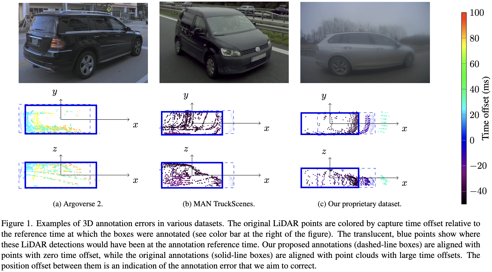
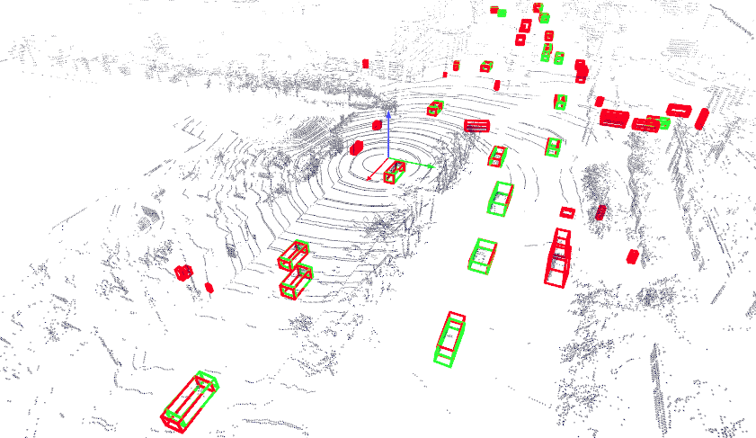

# Correcting and Quantifying Systematic Errors in 3D Box Annotations for Autonomous Driving

Official code of [Correcting and Quantifying Systematic Errors in 3D Box Annotations for
Autonomous Driving](https://arxiv.org/abs/2601.14038), accepted at The IEEE/CVF Winter Conference on Applications of Computer Vision 2026, by Justo Miro, A. et al.

## Key results
Our method improves the quality of 3D box annotations by more than 17%!

| Dataset         | IPD      | SDEDE-x  | SDEDE-y |
|-----------------|----------|----------|---------|
| Argoverse 2     | +17.53 % | 1.36 m   | 0.55 m  |
| MAN TruckScenes | +30.45 % | 2.54 m   | 1.19 m  |
| Proprietary     | +27.99 % | 2.17 m   | 0.69 m  |



For full results and details, see [our paper](https://arxiv.org/abs/2601.14038).

## Requirements

Python >=3.9 and <=3.13.

Access to the 10 selected sequences of the [Argoverse 2 sensor dataset](https://www.argoverse.org/av2.html#sensor-link) and/or the [MAN TruckScenes mini dataset](https://brandportal.man/d/QSf8mPdU5Hgj/downloads#/-/dataset/download-mini), by default located under `~/datasets`. The folder structure should be as follows:
```
─── <home directory>
    └── datasets
        └── argoverse2
            └── train
                └── 3ca11a5e-50b2-3cc3-af7a-ce7ab02b9954
                └── 58d01358-5927-36fa-9e11-d18d1dc1f4f0
                └── 6b14d7c0-20f9-390b-af38-507a5de5998c
                └── 81d2b40a-c579-3e9c-b520-bee26cda947d
                └── c556f8e0-a001-3586-b2cf-d3256685c39f
                └── c780d53a-2d37-3cd8-9e89-530966aef53e
                └── f648b945-6c70-3105-bd23-9502894e37d4
                └── fd5c6932-2ee2-3cfb-9bdc-0b30bfb33a91
            └── val
                └── 9a448a80-0e9a-3bf0-90f3-21750dfef55a
                └── d5d6f11c-3026-3e0e-9d67-c111233e22de
        └── man-truckscenes
            └── samples
            └── sweeps
            └── v1.0-mini
```
If desired, the default location and name of the `datasets/` folder can be specified by means of the flag `-b` or `--base-directory` when running the code (see [Run](#run) below).

## Install
From the repository root:
```
pip install --upgrade pip
pip install .
```

## Run
It is possible to correct the 3D box annotations, evaluate the corrected boxes, and visualize a sequence. For example, to correct the 3D box annotations in the 10 mentioned sequences from Argoverse 2, run from the `src` folder:
```bash
./run.py --dataset argoverse2 --correct
```
Once the boxes have been corrected, to evaluate them, run:
```bash
./run.py --dataset argoverse2 --evaluate
```
To visualize a sequence (e.g., the first sequence in Argoverse 2) interactively in [Rerun](https://rerun.io/), including LiDAR data and original and corrected boxes (if they have been generated), run:
```bash
./run.py --dataset argoverse2 --sequence train/c556f8e0-a001-3586-b2cf-d3256685c39f --visualize
```


See all possible options by running
```bash
./run.py --help
```

## Custom dataset
To use a custom dataset, implement a new class inheriting from `BaseDataLoader`, and implement the required abstract methods, such as those for loading sensor data, transforms, and annotations and putting them in the common format that our code expects. See `data_loaders/Argoverse2DataLoader.py` or `data_loaders/MANTruckScenesDataLoader.py` as examples for how to do this.

## Contributing
Users of the code are welcome to contribute and create pull requests or open issues in GitHub if need be.

## License
This project is licensed under the MIT License - see the [LICENSE](LICENSE) file for details.

## Citing

If you use our code in your research, please consider citing:

```
@inproceedings{annotationcorrection3dboxes2026,
  title={Correcting and {Quantifying} {Systematic} {Errors} in {3D} {Box} {Annotations} for
{Autonomous} {Driving}},
  author={Justo Miro, Alexandre and af Klinteberg, Ludvig and Timus, Bogdan and Asefaw, Aron and Khoche, Ajinkya and Gustafsson, Thomas and Mansouri, Sina Sharif and Daneshtalab, Masoud},
  booktitle={The IEEE/CVF Winter Conference on Applications of Computer Vision},
  year={2026}
}
```
